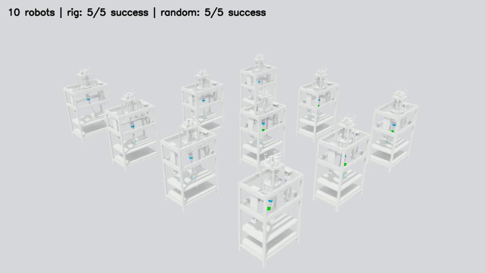
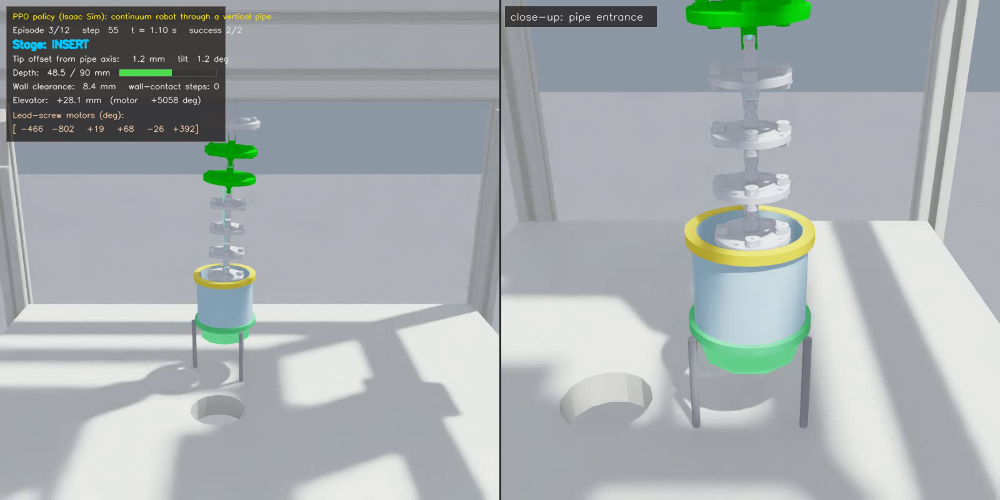
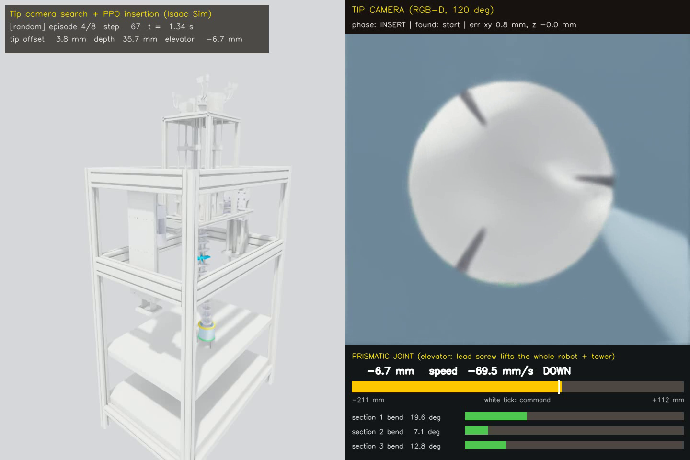
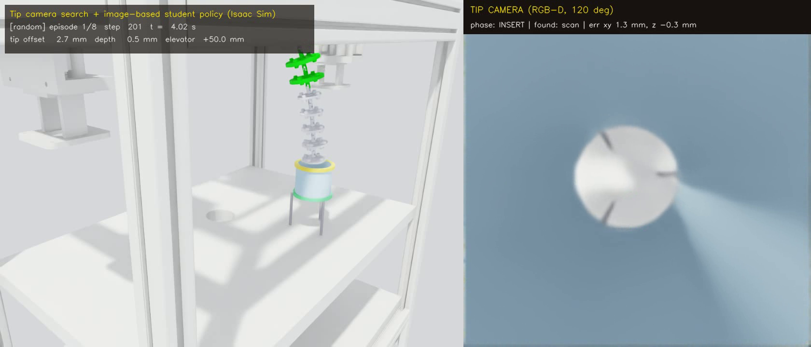
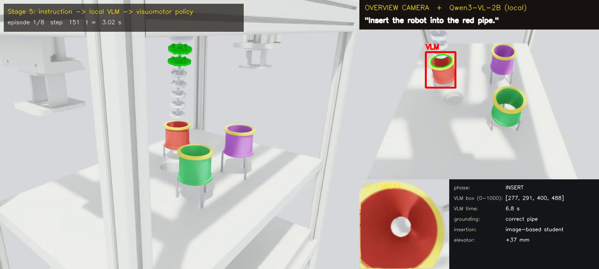

# Vertical-pipe task in Isaac Lab (port of the MuJoCo version)

Port of `D:\mujoco\Continuum_MuJoCo\task_vertical_pipe` (continuum robot bends into an S-shape
and feeds down through a vertical pipe) to Isaac Sim 5.1 / Isaac Lab 2.3.2, trained with rsl_rl.
Observation, action, reward, termination, reset / randomization, `dt` and `frame_skip` are the
ones of the MuJoCo env; the PPO update and hyperparameters are the ones of its SB3 trainer.





Videos (policy trained in MuJoCo, run in Isaac Sim): [12 random pipes, two-panel view](media/isaac_vertical_pipe_random_wide.mp4)
(12/12 success) and [10 robots at once](media/isaac_10_robots.mp4) (20/20 success).

| file | content |
|---|---|
| `constants.py` | task constants, copied 1:1 from `vertical_pipe_env.py` / `continuum_algorithm.py` |
| `kinematics.py` | MJCF kinematic tree + forward kinematics identical to `mj_kinematics` (numpy) |
| `reset_logic.py` | start-state sampling (`reset`, `_place_pipe`, `_assisted_start`), same numpy draws |
| `mdp.py` | action -> commands, measurements, observation (33), reward, termination (torch) |
| `vertical_pipe_env.py` | Isaac Lab `DirectRLEnv` + scene / sim configuration |
| `convert_mjcf_to_usd.py` | MJCF -> USD (robot) and the pipe USDs |
| `ppo_sb3.py`, `agent_cfg.py`, `pipe_runner.py` | rsl_rl PPO with the SB3 update rule, config, runner with eval / checkpoints |
| `train_vertical_pipe.py`, `play_vertical_pipe.py` | training / viewer, statistics, video |
| `import_sb3_policy.py` | SB3 model of the MuJoCo trainer (`.zip`) -> rsl_rl checkpoint (same networks) |
| `record_video.py` | two-panel MP4 (fixed wide view + close-up of the pipe entrance, HUD, guides) like the MuJoCo demo |
| `vision_env.py` | the env + an RGB-D camera on the tip (Seg15); the policy can see the camera's pipe estimate instead of the true pose |
| `perception.py` | pipe-mouth detector: yellow collar mask + depth -> 3D points -> circle fit (centre, height, quality) |
| `vision_pipeline.py` | look / lift / conical scan with the tip camera, return to the start pose, then the RL policy inserts |
| `play_vision.py` | statistics (vision vs true pose, sensor noise, `--student`) and MP4 with the tip-camera view |
| `preinsert.py`, `student_env.py` | pre-insertion hand-over poses (pipe in view) and the student's training starts |
| `student_policy.py`, `train_student.py` | image-based student (CNN on the tip RGB-D image + joint commands) and its DAgger training |
| `multi_pipe.py`, `multi_pipe_env.py` | Stage 5 scenes: 3 pipes of different tube colours, an instruction, an overview camera |
| `vlm.py` | local VLM (Qwen3-VL-2B): instruction + overview image -> box; HTTP server / client |
| `language_pipeline.py`, `play_language.py` | instruction -> VLM -> pipe -> pre-insertion pose -> image-based student; statistics / MP4 |
| `make_grounding_set.py`, `eval_grounding.py` | grounding benchmark: rendered scenes with ground truth, VLM accuracy without Isaac Sim |
| `make_showcase_video.py` | 1080p project video: title cards + MuJoCo / tip-camera / student / language clips + results |
| `tests/compare_with_mujoco.py` | checks against the MuJoCo env (runs in the MuJoCo venv) |
| `tests/check_isaac_env.py` | checks of the Isaac env, replay of MuJoCo trajectories in PhysX |
| `assets/mjcf/ContinuumRobot_Native.xml` | source MJCF (copy of `urdf/ContinuumRobot_Native.xml`) |

## Run

```cmd
cd D:\Continuum-Robot-Riclab-\task_vertical_pipe_isaaclab
set ISAAC=D:\Isaacsim\env_isaaclab\Scripts\python.exe

:: 0. (optional) engine-independent parts vs the MuJoCo env, writes tests/data/mujoco_reference.npz
D:\mujoco\Continuum_MuJoCo\.venv\Scripts\python.exe tests\compare_with_mujoco.py

:: 1. MJCF -> USD (assets/generated/, not in git). --mesh-dir: folder with the .obj meshes
%ISAAC% convert_mjcf_to_usd.py --mesh-dir D:\mujoco\Continuum_MuJoCo\urdf

:: 2. checks in Isaac Sim (kinematics, resets, replay of the MuJoCo episodes, random actions)
%ISAAC% tests\check_isaac_env.py

:: 3. train (3M steps, 16 envs, rig + random scenes; same options as the MuJoCo trainer)
%ISAAC% train_vertical_pipe.py
%ISAAC% train_vertical_pipe.py --pipe-mode rig --timesteps 1000000
%ISAAC% train_vertical_pipe.py --resume models\ppo_vpipe\best_model.pt --contact-penalty 0.5 --run-name ppo_vpipe_ft
%ISAAC% train_vertical_pipe.py --n-envs 12 --stop-at 200000 :: short run, lr schedule still over 3M steps
tensorboard --logdir logs

:: 4. watch / evaluate
%ISAAC% play_vertical_pipe.py                               :: Isaac Sim window, rig then random pipe
%ISAAC% play_vertical_pipe.py --num_envs 10                 :: 10 robots at once (even: rig, odd: random)
%ISAAC% play_vertical_pipe.py --headless --episodes 100     :: success statistics
%ISAAC% play_vertical_pipe.py --video --episodes 5          :: MP4 with HUD in videos\
%ISAAC% record_video.py                                     :: two-panel MP4 like the MuJoCo demo --fixed-camera
                                                            :: (12 random pipes, same scenes as the MuJoCo video)

:: the policy trained in MuJoCo, in Isaac Sim (or as a start for --resume)
%ISAAC% import_sb3_policy.py D:\mujoco\Continuum_MuJoCo\task_vertical_pipe\models\ppo_vpipe_wide\final_model.zip models\mujoco_ppo_vpipe_wide\model.pt
%ISAAC% play_vertical_pipe.py --checkpoint models\mujoco_ppo_vpipe_wide\model.pt
```

All scripts append `--/app/vulkan=false` (DirectX 12, as the other Isaac scripts on this machine)
and import torch / tensordict / rsl_rl before Kit starts (Windows DLL order).

## What is the same as MuJoCo

| | MuJoCo (`task_vertical_pipe`) | Isaac Lab |
|---|---|---|
| timestep / frame_skip | `opt.timestep` 0.002 s, `N_SUBSTEPS` 10 | `sim.dt` 0.002 s, `decimation` 10 (20 ms, 50 Hz) |
| episode | 400 steps, truncation | `max_episode_steps` 400 (`episode_length_s` 8 s), `time_outs` |
| action (7) | bend-vector rates of 3 sections + elevator rate | `mdp.update_commands` (same rates, clipping, THETA_MAX) |
| observation (33) | `_get_obs` | `mdp.observation` (same terms, order and scaling) |
| reward | potential progress, time, wall contact, smoothness, +100 / -30 | `mdp.step_reward` |
| termination | success / unstable / rim_hit / missed_pipe | `mdp.outcome` |
| reset | pipe placement, assisted starts (40 % in training), 50 attempts | `reset_logic.py`; env i uses `default_rng(seed + i)` like SB3's seeding |
| scenes | `--pipe-mode mixed`: even envs rig, odd envs random | `pipe_modes=("rig", "random")`, same split |
| parallel envs | 16 (`SubprocVecEnv`, code default; the model in the task README was trained with 12) | 16 (`--n-envs`) |
| physics | gravity 0, servos kp 100 / kv 2 (elevator 3e4 / 1.2e3), armature 0.01, damping 0.5, force limit 20 N m, friction 0.3 | same values on PhysX implicit drives / materials |

Checked (`tests/`):
- the MJCF given to the importer compiles in MuJoCo to the model the MuJoCo env simulates (masses,
  joints, actuators, colliders; 300 steps with random controls differ by 3e-17);
- `kinematics.py` vs `mj_kinematics`: 1e-15 m; PhysX link poses of the USD vs `kinematics.py`: 0.005 mm;
- 3600 resets (1661 assisted) sampled like MuJoCo for the same seeds: identical (1e-15);
- `mdp.py` fed with MuJoCo states over 6075 steps (all outcomes, 937 wall-contact steps):
  observations bit-identical, rewards within 7e-15, no episode-end mismatch;
- replay of 72 MuJoCo episodes (same start state and actions) in PhysX: tip position differs by
  0.48 mm on average (95 %: 0.80 mm), reward by < 0.014 on 95 % of the steps, wall-contact steps
  agree on 900 of 905, the episode outcome is the same in 67/72 episodes (the others: 3 failures of
  another kind a few steps earlier - the tip passes within 1 mm of the rim - and 2 long random-action
  episodes that diverge after ~100 steps of wall contact). All observation terms agree (95 %: body
  positions < 0.7 mm, commands / pipe offset / previous action exact) except the contact count
  (`min(n, 4) / 4`), where the two engines produce different numbers of points per touch (mean
  difference 0.8 contacts);
- the policy trained in MuJoCo (`ppo_vpipe_wide/final_model.zip`, via `import_sb3_policy.py`) run in
  Isaac Sim (`play_vertical_pipe.py --headless --episodes 100 --seed 9000`):

  | scene | Isaac Sim | MuJoCo (task README) |
  |---|---|---|
  | rig | 99 % success (1 rim hit), 2.39 s, clearance median 4.0 mm, 100 % without wall contact | 100 %, 2.4 s, 4.0 mm, 100 % |
  | random 0-17 cm | 99 % (1 rim hit), 1.86 s, clearance median 5.9 mm, 81 % without wall contact | 99 % (1 rim hit), 83 % |

## MJCF -> USD

`convert_mjcf_to_usd.py` rebuilds the model the MuJoCo env simulates (the env edits the MJCF in code:
it removes the mesh colliders, adds one collision cylinder per segment, 31 position servos, armature
and damping), converts it with the Isaac Sim MJCF importer (`isaaclab.sim.converters.MjcfConverter`)
into `continuum_physics.usd` (colliders only, for training) and `continuum_visual.usd` (+ CAD meshes),
and writes `pipe_rig.usd` / `pipe_random.usd` (24 box staves on a kinematic body, bore 100 / 70 mm).

What the importer does not carry over, and the replacement:

| MuJoCo | Isaac Sim / Isaac Lab |
|---|---|
| tendons, equality constraints, `cable` / `flexcomp` plugins | none in this model (the continuum body is already a chain of 15 rigid universal joints, joint angle = section bend / 5). For other models: fixed tendons -> PhysX fixed tendons (the importer converts them), `equality joint` -> PhysX tendon / mimic joint, `weld` / `connect` -> fixed / spherical joint, cable / flexcomp -> chain of rigid capsules with drives, or a PhysX deformable body |
| `<option>` (timestep, gravity 0, implicitfast, Newton, pyramidal cone) | `SimulationCfg(dt=0.002, gravity=0)`, PhysX TGS, 8 position / 1 velocity iterations; drives are implicit like implicitfast |
| position servo `kv` (dropped by the importer) and joint damping | `ImplicitActuatorCfg`: stiffness kp, damping kv + 0.5, effort limit = `actuatorfrcrange` (20 N m), armature 0.01 |
| contact parameters: `solref`, `solimp`, `margin`, `condim`, torsional / rolling friction | PhysX rigid contacts: friction 0.3 static = dynamic (only sliding friction is used with condim 3), restitution 0, contact offset 2 mm, rest offset 0. MuJoCo's soft contacts let the tip sink 0.5-1.3 mm into the rim before `rim_hit`; PhysX does not penetrate, so a point outside the rim-radius counts as a hit up to 1 mm of separation (`rim_touch_tolerance`; 1 mm gives the best outcome agreement: 0.1 mm 59/72, 0.5 mm 64/72, 1 mm 67/72, 2 mm 65/72) and an inner-wall point counts as contact up to 0.1 mm (`contact_touch_tolerance`) |
| `contype` / `conaffinity` (segments never collide with each other) | importer: filtered pairs; `enabled_self_collisions=False` |
| mocap pipe body | kinematic rigid body, moved at reset (`write_root_pose_to_sim`) |
| world-body frame geoms + slide joint to the world | jointless `base_link` root (fixed joint), the elevator is a prismatic articulation joint; the importer anchors the fixed joint at the world origin, the env moves each env's anchor to its env origin |
| extra `worldBody` articulation root, visual copies of the collision cylinders, instanced colliders | removed / hidden / de-instanced by the converter |
| contact list `data.contact` | PhysX contact points of every segment with the pipe of its env (tensor contact view). MuJoCo gives 1-2 contacts per segment / stave pair, PhysX a patch of up to ~30 points: the wall-contact count uses one contact per (segment, stave) pair, the stave found from the point's angle around the pipe axis. PhysX leaves the contact buffers untouched in a step without any contact in the scene, so stale points of an earlier contact come back (with few envs this gave false rim hits right after resets); a point is only used if it lies on the current collider of its segment (`contact_point_tolerance`, 1.5 mm beyond its separation) |
| `mj_forward` + `ncon == 0` test of a start pose | `kinematics.pipe_overlap` (sampled cylinder / box overlap); gives the same accept / reject as MuJoCo on all 1800 test resets |
| `mjWARN_BADQACC` ("unstable") | non-finite joint state or joint speed > 1000 rad/s (m/s) |

Small remaining differences: PhysX vs MuJoCo integration and contact dynamics (see the replay numbers);
MuJoCo's body poses after `mj_step` belong to the start of the last substep, PhysX's to its end (2 ms);
the servo force limit also clips the passive damping part in PhysX.

## Training (rsl_rl)

`ppo_sb3.SB3PPO` is rsl_rl's PPO with the update of Stable-Baselines3 PPO, the trainer of the MuJoCo
version; rsl_rl provides the rollout storage, runner and logging.

| SB3 (MuJoCo trainer) | here |
|---|---|
| `learning_rate=linear_schedule(3e-4, 1e-5)` | same schedule, per timestep (resume: 1e-4 -> 1e-5) |
| `n_steps=512`, `batch_size=1024`, `n_epochs=10` | `num_steps_per_env=512`, `num_mini_batches=8` (16 envs), 10 epochs |
| `gamma=0.99`, `gae_lambda=0.95`, `clip_range=0.2`, `ent_coef=0`, `vf_coef=0.5`, `max_grad_norm=0.5` | same |
| `net_arch pi=[256,256], vf=[256,256]`, Tanh, `log_std_init=-0.5`, ortho init | same (`init_std=exp(-0.5)`, log-std parameter, SB3 orthogonal init) |
| Adam eps 1e-5, minibatches reshuffled every epoch, advantage normalised per minibatch, unclipped value loss, one grad-norm clip | same (rsl_rl defaults differ; overridden in `SB3PPO`) |
| truncated episodes bootstrapped with V(terminal observation) | same (`extras["terminal_obs"]`; rsl_rl would use V(s_t)) |
| `CheckpointCallback` 200k, `EvalCallback` 50k / 20 deterministic episodes / `best_model`, `PipeStatsCallback` | `PipeRunner` (same frequencies and TensorBoard tags `eval/*`, `pipe/*`) |
| 3M steps, 16 envs, seed 0, PPO on CPU | same (`--ppo-device cpu`; PhysX on `--device cuda:0`) |

Isaac Sim runs one simulation per process, so there is no separate eval env: the evaluation saves the
state of all training envs, runs the episodes (no assisted starts, own random streams) and restores
the state afterwards.

### Learning speed depends strongly on the seed (also in MuJoCo)

The curve in the MuJoCo README (90 % eval success at 200k steps) comes from one run with 12 envs.
The original MuJoCo trainer, rerun unchanged, gives at 200k steps (training success of the last 200
episodes):

| MuJoCo SB3 | seed 0 | seed 1 | seed 2 |
|---|---|---|---|
| 12 envs | 76 % | 0 % (hovers above the pipe) | 18 % |
| 16 envs (code default) | 16 % | 0 % (hovers) | 21 % |

Isaac Lab, same settings: 16 envs / seed 0 with rsl_rl: 0 % at 150k; SB3 itself on the Isaac env
(A/B check of the rsl_rl port): 0 % at 200k, with the same early statistics as MuJoCo 16 envs / seed 0
(50k steps: 0 % success, 7 % rim hits, 92 % time-outs in both). 12 envs / seed 0 with rsl_rl: see
"Results" below. Several seeds (or the MuJoCo policy as a start, `--resume`) are needed to compare
learning speed; one run is not enough in either simulator.

Note: the Isaac training runs in this section and the next one were made before the stale-contact
fix (see the contact row in the MJCF -> USD table). Stale points could end an episode with a false rim
hit right after a reset whenever no env was touching its pipe, which made learning harder; the numbers
are kept for reference and have to be redone.

### Results of the short training check

`train_vertical_pipe.py --n-envs 12 --stop-at 200000` (seed 0, learning-rate schedule over 3M steps,
25.9 min on the GPU, 20 deterministic evaluation episodes every 50k steps):

| steps | 55k | 104k | 154k | 203k |
|---|---|---|---|---|
| Isaac Lab / rsl_rl: eval success | 0 % | 0 % | 15 % | 80 % |
| Isaac Lab / rsl_rl: eval mean reward | -8.8 | -5.8 | 14.4 | 76.2 |
| MuJoCo README run (12 envs): eval success | 0 % (50k) | 15 % (100k) | 75 % (150k) | 90 % (200k) |

`best_model.pt` of that run, 100 episodes per scene: rig 92 % success (8 time-outs), random 64 %
(13 rim hits, 23 time-outs). It still slides along the wall (68 wall-contact steps per rig episode)
and is slow (5.7 s); it has seen 7 % of the 3M training steps.

## Tip camera: find the pipe, then insert (vision pipeline)

The policy above reads the true pipe pose (`pipe_xy`, `z_top`) in its observation, which a real
robot does not have. `vision_env.py` puts an RGB-D camera on the tip (Seg15, on the tip axis, 0.5 mm
outside the tip face, looking out of it, 120 deg, 160 x 160 px) and lets the policy see the pipe pose
*measured by that camera* instead; reward / termination still use the true pose. The policy itself is
unchanged (`models/mujoco_ppo_vpipe_wide/model.pt`).



Videos of the same 8 random pipes (seed 1): [whole rig, the elevator tower rising and sinking with the
prismatic joint, joint gauge](media/isaac_vision_tipcam_wide.mp4) and [close view of the
pipe](media/isaac_vision_tipcam.mp4), both with the tip camera (magenta: collar pixels, green:
estimated pipe mouth). 6 of the 8 pipes are only found by the scan; 7/8 success; the rim hit, with a
1.1 mm estimate error, is a start state where the policy succeeds with the true pose.

```cmd
%ISAAC% play_vision.py --episodes 100                        :: statistics, rig + random pipe
%ISAAC% play_vision.py --episodes 100 --obs-source gt        :: same scenes, true pose (baseline)
%ISAAC% play_vision.py --depth-noise 0.005 --rgb-noise 0.05  :: sensor noise
%ISAAC% play_vision.py --meshes                              :: CAD frame / plate / robot in the camera view
%ISAAC% play_vision.py --video --pipe-mode random --episodes 8 --seed 1   :: whole rig + tip camera + joint gauge
%ISAAC% play_vision.py --video --view close --pipe-mode random --episodes 8 --seed 1   :: close view of the pipe
```

Pipeline (`vision_pipeline.SearchInsertController`, one state machine per env, same 7-D action as the policy):

| phase | what the robot does |
|---|---|
| LOOK | holds the start pose 4 steps (servo lag, render latency), measures; a collar seen over >= 50 % of its circle -> INSERT |
| LIFT | elevator to the top (wider view), measures again |
| SCAN | sections 2 + 3 bent the same way (0.25 / 0.35 rad: camera tilted ~0.6 rad), bend direction turned around the robot axis; stops when the collar pixel count has peaked, settles, measures |
| RETURN | bend back to the start bend, then elevator down to the start height: the policy starts from the pose it was trained on, and the way back is the way out |
| REFINE | measures again at the start pose if the collar is in view (closer, better) |
| INSERT | the RL policy with the estimated pipe pose in its observation |

Detector (`perception.PipeDetector`, classical): yellow-collar colour mask -> depth (5 x 5 median) ->
3D points in the env frame (camera pose = Seg15 link pose + mounting offset, i.e. forward kinematics)
-> points of the collar's flat top face -> circle of known radius (algebraic start, Gauss-Newton with
outlier trimming; a partial arc works). A short arc also fits a circle on its other side: the centre
that has the light-blue tube inside the collar wins. Points beyond 0.5 m (other rigs in the scene)
and centres outside the robot's reach are rejected.

Results, 100 episodes per scene and setting (same start states for all settings of a seed; episode
limit 1000 steps for search + insertion):

| success rate (rig / random) | seed 9000 | seed 1 |
|---|---|---|
| true pipe pose, no search (baseline) | 100 % / 99 % | 100 % / 95 % |
| tip camera, colliders only in view | 100 % / 99 % | 100 % / 96 % |
| tip camera, CAD frame / plate / robot in view (`--meshes`) | 100 % / 99 % | 100 % / 96 % |
| tip camera, depth noise 2 mm, colour noise 0.03 | 100 % / 99 % | |
| tip camera, depth noise 5 mm, colour noise 0.05 | 100 % / 99 % | 100 % / 95 % |
| tip camera, depth noise 5 mm, colour noise 0.05, `--meshes` | 100 % / 99 % | |

| error of the estimated pipe mouth (xy: median / 95 % / max) | rig | random |
|---|---|---|
| no noise | 0.5-0.7 / 0.9-1.3 / 1.5 mm | 0.7-0.9 / 2.0-2.5 / 3.7 mm |
| depth noise 5 mm | 0.9-3.1 / 2.0-5.9 / 8.2 mm | 1.4-2.1 / 3.9-5.1 / 6.8 mm |

(z error: median <= 0.15 mm, max 3.8 mm without noise; median 0.3-3.3 mm with 5 mm depth noise.)
Every failure is a rim hit during the insertion; on seed 1 they are mostly in the start states where
the policy also hits the rim with the true pose (policy limit, not perception).
How the pipe was found: rig 33-44 % from the start pose, 43-62 % after lifting, 5-13 % by the scan;
random pipe 32-36 % start, 12-20 % lift, 47-52 % scan. Search and hand-over take 1.1-1.6 s on
average (max 7 s), so a successful episode takes 2.9-4.0 s instead of 1.8-2.5 s.

Bugs found on the way (fixed): with the camera tilted towards the horizon it saw the pipe of the
neighbouring rig 2 m away (-> range limit + workspace check); at grazing angles most collar pixels
are on its 6.6 mm outer wall, which pulled the centre up to 3.7 mm towards the camera (-> top face
only); with noise, one short arc was fitted on its wrong side (80 mm error, -> tube-inside test).

What this is and is not: a **vision-guided, modular** pipeline (camera -> classical perception ->
pose estimate -> RL policy), not a VLA model: there is no language input and no end-to-end model
from pixels to actions. Limits of this step:
- the detector relies on the yellow collar, i.e. a colour marker; a real pipe needs a learned
  detector (e.g. a small CNN trained on images rendered here, with the true pose as label, and
  randomised lighting / textures);
- the camera pose comes from the simulated link pose (exact forward kinematics); on the real
  continuum robot the tip pose itself has kinematic errors;
- the noise model is independent Gaussian noise per pixel; the policy was not trained with
  estimation errors.
Next steps: the image-based student below, then a language-conditioned target choice (several
pipes, a VLM picks the one named in the instruction), and finally a VLA fine-tuned on (image,
instruction, action) demonstrations generated with these policies in Isaac Lab.

## Image-based student: insertion from pixels (teacher-student distillation)

The pipeline above still gives the PPO policy a pipe *pose*. The student policy
(`student_policy.StudentPolicy`) gets none: its input is the tip camera (RGB + depth, 64 x 64) and
the robot's own commands (bend vectors, elevator, previous action), its output the 7-D action. It is
trained with DAgger (`train_student.py`) to reproduce the privileged PPO policy (the teacher, which
reads the true pipe pose) on the states the student itself visits.



Video: [the same 8 random pipes as above (seed 1), inserted by the student](media/isaac_student.mp4)
(8/8 success; same scene view as the tip-camera video above). Project video with all stages: [showcase.mp4](media/showcase.mp4).

```cmd
%ISAAC% train_student.py --num_envs 64 --iterations 150 --meshes        :: 614k steps, 18 min
%ISAAC% play_vision.py --student models\student_vpipeinal.pt --meshes --episodes 100
%ISAAC% play_vision.py --student models\student_vpipeinal.pt --video --view close --pipe-mode random --episodes 8 --seed 1
%ISAAC% make_showcase_video.py                                           :: videos\showcase.mp4 (no Isaac Sim needed)
```

Hand-over: from the task's start pose the tip camera sees the pipe in only ~20-45 % of the episodes,
and a policy without a pipe pose cannot know which way to go when it sees nothing. So the search of
the pipeline above is kept (it uses the detector only to put the pipe in view), and the robot then
goes to a **pre-insertion pose** (`preinsert.preinsert_pose`): the S-curve partly formed towards the
estimated pipe (0.6-1.0 x the aligned bend, section 3 straight), the tip 3-5 cm above the mouth, the
smallest such pose from which the camera sees >= 60 % of the collar ring and that does not touch the
pipe; the robot goes up first, then bends, then down. These poses are inside the teacher's training
distribution (its assisted starts), so its labels are good there.

Training (`train_student.py`): 64 envs with the CAD frame / plate / robot in view; starts from
`preinsert.StudentStartSampler` (75 %: pre-insertion poses computed from a pipe estimate with up to
6 mm / 3 mm xy / z error and 0.02 rad bend noise, >= 40 % of the true ring in view; 25 %: normal task
starts that already see the pipe); each episode driven by the teacher with probability beta (1 -> 0
over 10 iterations), every state stored with the teacher's action (250k ring buffer), MSE with
random-shift augmentation, Adam 3e-4. The network: 4 stride-2 convolutions on RGB-D + pixel
coordinates, 256-unit MLP with the 14 joint-command inputs. From iteration 15 on (~65k samples) the
student succeeds in 100 % of the episodes it drives; the teacher also reaches 100 % from these starts.

Full pipeline (search -> pre-insertion pose -> student), 100 episodes per scene and setting:

| success rate (rig / random) | seed 9000 | seed 1 |
|---|---|---|
| student, CAD meshes in view (as trained) | 100 % / 100 % | 100 % / 100 % |
| student, depth noise 5 mm, colour noise 0.05 (not trained with noise) | 100 % / 100 % | |
| student, colliders only in view (other background than trained) | 100 % / 100 % | |
| for comparison: PPO + camera estimate from the start pose (section above) | 100 % / 99 % | 100 % / 96 % |
| for comparison: PPO with the true pose from the start pose | 100 % / 99 % | 100 % / 95 % |

Read the comparison rows with care: the student starts inserting from the pre-insertion pose, which
is easier than the task's start pose (the teacher also succeeds 100 % from there). What the table
shows is that the student **matches its privileged teacher from pixels and joint commands alone**;
the gain over the rows below comes from the hand-over pose, not from the student being better than
the teacher. A successful episode takes 3.7-5.1 s (search and approach 1.9-2.9 s on average).

Still missing for the real robot: the search and the hand-over still use the colour-marker detector;
the student was trained on one pipe look (colour, lighting) without domain randomisation; the camera
images are rendered, not real.

## Stage 5: language-conditioned insertion with a local VLM (hierarchical VLA)

Three pipes stand in the robot's reach, each with a different tube colour (red, green, blue, purple,
white, black; the yellow collar stays on all of them). An instruction names one of them by colour
("Go through the red pipe.") or by its place in the overview image ("Insert into the pipe on the far
left.", "Go through the pipe closest to the camera."). The robot has to go through that pipe; the
other two are obstacles (touching them counts as a failure).



Video: [8 instructions, 8/8 through the named pipe](media/isaac_language.mp4) (red box: the VLM's
answer, green ring: the pipe located in it). The VLM answer takes ~6 s on the CPU; the video does not
show that wait.

Pipeline (`language_pipeline.LanguageInsertController`):
1. a fixed **overview camera** on the rig (RGB-D, 640 x 480, inside the frame in front of the robot)
   sees the table;
2. **Qwen3-VL-2B-Instruct** (Apache-2.0, 2B parameters, runs locally with `transformers`; no API, no
   tokens) gets the image and the instruction and answers with a box (`vlm.py`);
3. every pipe mouth in the overview image is located in 3D (collar mask, depth, circle fit:
   3/3 pipes found in 60/60 test scenes, 0.54 mm median error); the one the box points at is the
   target, the others are obstacles;
4. the robot goes to the target's pre-insertion pose (clear of the other pipes) and the **image-based
   student** threads it.

The student was fine-tuned for these scenes (`train_student.py --multi --init models\student_vpipeinal.pt`,
410k steps, 13 min): other pipes around, tube colour of the target random (25 % the original light
blue). It succeeds in 100 % of the episodes it drives from iteration 10 on.

```cmd
%ISAAC% make_grounding_set.py --scenes 300                   :: rendered scenes + ground truth (data\grounding)
%ISAAC% eval_grounding.py                                     :: VLM accuracy, no Isaac Sim
%ISAAC% train_student.py --multi --init models\student_vpipeinal.pt --meshes --num_envs 64 --iterations 100 --beta-iters 3 --buffer 150000 --run-name student_multi
%ISAAC% vlm.py --serve --device cpu                           :: the VLM in its own process (the 8 GB GPU is Isaac Sim's)
%ISAAC% play_language.py --interactive                        :: Isaac Sim window, type your own instruction
%ISAAC% play_language.py --episodes 100 --vlm-url http://127.0.0.1:8765/ground
%ISAAC% play_language.py --video --episodes 8 --seed 7100 --p-position 0.6 --vlm-url http://127.0.0.1:8765/ground   :: --view wide: whole rig
```

Grounding benchmark (`eval_grounding.py`, 300 rendered scenes, VLM on the GPU, 1.5 s per scene):

| instructions | n | box on the right pipe | 3D pipe right |
|---|---|---|---|
| all | 300 | 86.3 % | 86.7 % |
| colour | 171 | 90.1 % (black 100, red 97, green 93, purple 92, blue 85, white 77) | 90.1 % |
| position: left / right | 70 | 93 % / 100 % | |
| position: closest / farthest from the camera | 59 | 71 % / 57 % | |

Left / right is easy for the 2B model, depth relations from a single image are not; the white pipe on
the white table is the hardest colour. A longer prompt that explains the relations ("the pipe closest
to the camera is the lowest in the image") made the position instructions worse: 81 % -> 43 %.

Closed loop (`play_language.py`, 100 episodes, 3 pipes, VLM on the CPU in its own process):

| | picks the right pipe | whole task | insertion when the right pipe was picked |
|---|---|---|---|
| all | 91 % | 90 % | 98.9 % |
| colour instructions (66) | 92.4 % | 90.9 % | 98.4 % |
| position instructions (34) | 88.2 % | 88.2 % | 100 % |

9 of the 10 failures are grounding errors (the VLM chose another pipe, and the robot went through that
one); 1 is a rim hit. The VLM needs 6.4 s per instruction on the CPU. Loading it on the GPU next to
Isaac Sim (8 GB) made the renderer fail, hence the separate process.

`--interactive`: one robot in the Isaac Sim window; the terminal lists the pipes on the table and
asks for an instruction (Enter = the generated example, `n` = new scene, `q` = quit). Free-form
instructions have no ground truth, so the pipe the VLM picks becomes the target
(`MultiPipeEnv.retarget` swaps it with the contact-monitored pipe) and success is judged for it.
The VLM runs on the CPU in the same process (~10 s per instruction; the window waits meanwhile).

What this is: a **hierarchical vision-language-action system** (VLM for the language and the target,
a learned visuomotor policy for the motion), not an end-to-end VLA model. Next step: an end-to-end
VLA (e.g. SmolVLA) fine-tuned on (image, instruction, action) demonstrations generated with this
pipeline.

## Notes

- PhysX GPU pipeline only: on the CPU pipeline of Isaac Sim 5.1 the kinematic pipe is moved back to
  its USD pose every step and the tensor contact view returns no contacts (`VerticalPipeEnv` refuses
  `sim.device="cpu"`).
- Speed on this laptop (RTX 5070 Laptop, Windows): ~220 env-steps/s with 16 envs (3M steps ~ 4 h),
  ~920 env-steps/s with 72 envs; the MuJoCo trainer runs ~2300 steps/s. With 16 small articulations
  the GPU pipeline is dominated by its fixed cost per physics step; more envs use the GPU far better
  but change the training setup (batch size per update).
- The random scene's pipe has no legs in the viewer (MuJoCo draws three decorative legs).
- `env.auto_reset = False` keeps finished envs in their final pose until `env.reset_envs(ids)`
  (used by the viewer / video).
- Outputs (`models/`, `logs/`, `videos/`, `assets/generated/`, `tests/data/`) are not in git.
